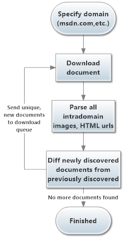

# Akka.NET Clustering Sample: WebCrawler

The goal of this sample is to show you how to use `Akka.Cluster` to form resilient systems that can scale out across multiple processes or machines without complicated user-defined code or expensive tools.

In this sample you'll also see how to integrate Akka.NET with the following technologies:

- **[ASP.NET MVC5](http://www.asp.net/mvc/mvc5)**;
- **[SignalR](http://signalr.net/ "Websockets for .NET")** - Websockets library for .NET;
-  **[Topshelf](http://topshelf-project.com/ "Topshelf Project - easily turn console apps into Windows Services")** - Windows Services made easy; 
-  **[HTML Agility Pack](http://htmlagilitypack.codeplex.com/)** - for parsing crawled web pages; and
- **[Lighthouse](https://github.com/petabridge/lighthouse "Lighthouse - Service Discovery for Akka.NET")** - a lightweight service discovery platform for Akka.Cluster.

## Sample Overview

In the `WebCrawler` sample we're actually going to run three different pieces of software concurrently:

* **`[Lighthouse]`** - An instance of the **[Lighthouse](https://github.com/petabridge/lighthouse "Lighthouse - Service Discovery for Akka.NET")** service, so you'll want to clone and build that repository in you intend to run this sample;
* **`[Crawler]`** - A dedicated Windows Service built using **[Topshelf](http://topshelf-project.com/ "Topshelf Project - easily turn console apps into Windows Services")**. This is where most of the heavy lifting is done in this sample, and multiple instances of these services can be run in parallel in order to cooperatively execute a web crawl. The source for `[Crawler]` is inside the [`src\WebCrawler.Service`](src\WebCrawler.Service) folder.
* **`[Web]`** - An ASP.NET MVC5 application that uses **[SignalR](http://signalr.net/ "Websockets for .NET")** to send commands to and receive data from `[Crawler]` instances. Multiple `[Web]` instances may be run in parallel, but they're unaware of eachother's crawl jobs by default.

> NOTE: `WebCrawler.sln` should attempt to launch one instance of `[Crawler]` and `[Web]` by default.

### Goal: Use Microservices Built with Akka.Cluster to Crawl Web Domains with Elastic Scale

The goal of this sample is to have all three of these services work cooperatively together to crawl multiple web domains in parallel. Here's what the data flow of an individual domain crawl looks like:

The crawl begins by downloading the root document of the domain, so if we were to crawl [http://petabridge.com/](http://petabridge.com "Petabridge LLC homepage") we'd begin by downloading `index.html`.

On `index.html` we discover links to more images and documents, so we mark those new pages as "discovered" and repeat the downloading / parsing process until no more content has discovered.

> NOTE: the only thing this sample does not attempt to do is save the documents to a persistent store; that's an exercise left up to readers.

Here's an example of the service in-action, crawling MSDN and Rotten Tomatoes simultaneously across two `[Crawler]` processes:

<a href=
"diagrams/crawler-live-run.gif">
Click for a full-sized image.
</a>

## Critical Concepts

In this example you'll be exposed to the following concepts:

1. **Clustering** - a distributed programming technique that uses peer-to-peer networking, gossip protocols, addressing systems, and other tools to allow multiple processes and machines to work cooperatively together in an elastic fashion.  
2. **Microservices** - the software architecture style used to organize the WebCrawler sample into dedicated services for maximum resiliency and parallelism.
3. **Akka.NET Remoting** - how remote addressing, actor deployment, and message delivery works in Akka.NET.
4. **ASP.NET & Windows Services Integration** - how to integrate Akka.NET into the most commonly deployed types of networked applications in the .NET universe.

### Microservice Architecture

"Microservice" is a relatively new term in the lexicon of distributed systems programming. Here's [how "Microservice" is defined by Martin Fowler](http://martinfowler.com/articles/microservices.html):

> In short, the microservice architectural style [1] is an approach to developing a single application as a suite of small services, each running in its own process and communicating with lightweight mechanisms, often an HTTP resource API. These services are built around business capabilities and independently deployable by fully automated deployment machinery. There is a bare minimum of centralized management of these services, which may be written in different programming languages and use different data storage technologies.

Microservices aren't so different from traditional [Service Oriented Architecture (SOA)](https://msdn.microsoft.com/en-us/library/aa480021.aspx) approaches to software design, the key difference being that microservices break up applications into physically separate services running in their own processes and (often) hardware. At Petabridge we describe Microservices as "SOA 2.0."

Akka.Cluster makes it trivially easy to build apps that leverage a variety of microservices, and here's how:

