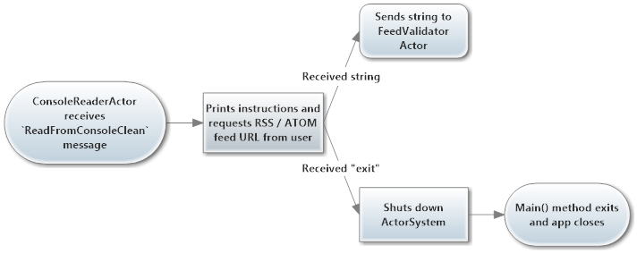
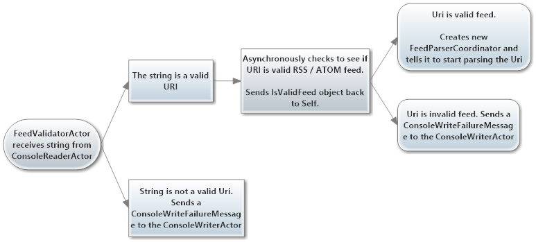
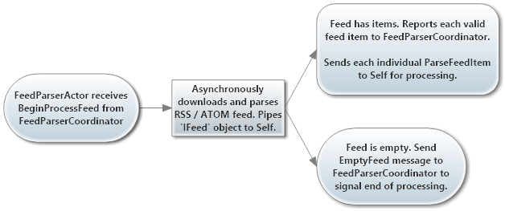
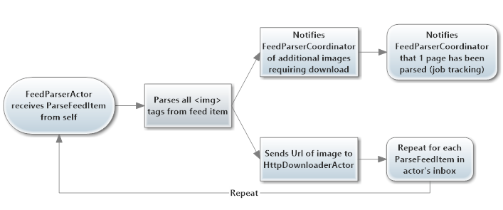
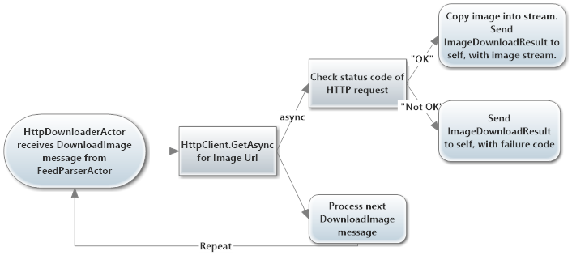
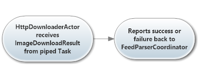
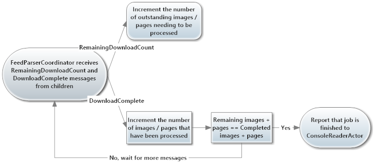
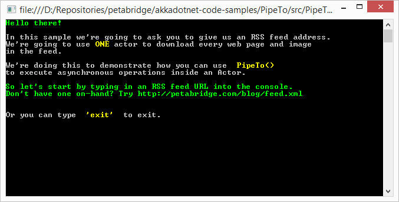
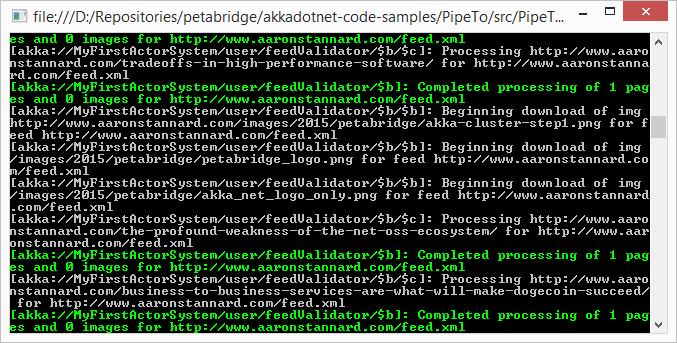

# Akka.NET PipeTo Sample

The goal of this sample is to show you how you can use the `PipeTo` extension method within [Akka.NET](http://getakka.net/ "Akka.NET - Distributed actor system for C# and F#") to allow a single actor to make many asynchronous calls simultaneously using the [.NET Task Parallel Library (TPL)](https://msdn.microsoft.com/en-us/library/dd460717(v=vs.110).aspx "Task Parallel Library (TPL)").

> **This is actually a fairly small and simple example, but we've documented it in extensively so you can understand all of our assumptions and modeling with Akka.NET. Don't confuse "detailed" with "complex."**

## Sample Overview

In this sample we're going to ask the user to provide us with the URL of a valid RSS or ATOM feed, and we're going to:

* Validate that the URL resolves to an actual RSS / ATOM feed;
* Parse all of the `` tags out of the bodies of the items in the feed; and
* Asynchronously download all images for each blog post in parallel *using a single actor*, even though [Akka.NET actors can only process one message at a time](http://petabridge.com/blog/akkadotnet-what-is-an-actor/ "What is an Akka.NET actor?")!

The goal of this is to show you that, yes - even though actors can only process one message at a time they can still leverage `async` methods and `Task<T>` objects to do multiple things in parallel.

> **Note**: with some fairly small changes, you could modify this sample to create an offline, local backup of every blog post in a remote RSS or ATOM feed. 
> 
> This code can also process multiple RSS or ATOM feeds in parallel without any modification - you'd just need to change the user interface to be able to provide multiple feed URLs at once. 
> 
> Maybe you should give one of these suggestions a try once you've had a chance to grok the sample? ;)

## Critical Concepts

This sample should illustrate the following concepts:

1. That although the actors are only processing a single RSS / ATOM feed, you could easily have them process hundreds of feeds in parallel *without writing any additional actor code*. All you'd have to do is send additional feed uris to the `FeedValidatorActor`. This is what makes actors fundamentally powerful - any process you've written using actors can be automatically parallelized.
2. That even though actors can only process one message at a time, they can still run asynchronous tasks in the background just like any other class. The trick to doing this effecitvely, however, is to make sure that the results of those asynchronous tasks are *delivered back to the actor as messages*. This is what `PipeTo` does.

### Questions

**Why can't you use `async` and `await` inside the actor's `OnReceive` methods?**

As we discussed in "[Akka.NET: What is an Actor?](http://petabridge.com/blog/akkadotnet-what-is-an-actor/ "Akka.NET: What is an Actor?")" - the mailbox pushes messages into your actor's `OnReceive` method as soon as the previous iteration of the `OnReceive` function exits. So whenever you `await` an `async` operation inside the `OnReceive` method, *you prematurely exit* the `OnReceive` method and the mailbox will push a new message into it. 

> `Await` breaks the "actors process one message at a time" guarantee, and suddenly your actor's context might be different. Variables such as the `Sender` of the previous message may be different, or the actor might even be shutting down when the `await` call returns to the previous context.

*So just don't do it.* `Await` is evil inside an actor. `Await` is just syntactic sugar anyway. Use `ContinueWith` and `PipeTo` instead. Turn the results of `async` operations into messages that get delivered into your actor's inbox and you can take advantage of `Task` and TPL methods just like you did before.

**What are those `TaskContinuationOptions.AttachedToParent & TaskContinuationOptions.ExecuteSynchronously` flags you keep using on `ContinueWith` inside an actor?**

Those are a set of bitmasked options specific to the `Task` class, and in this case we're telling the TPL to make sure that the `ContinueWith`, known as a "task continuation," gets executed immediately after the parent task returns its asynchronous result and executes using the same thread as its parent. 

Sometimes your continuations can be executed on a totally different thread or scheduled to run at a different time and this can cause unpredictable behavior inside actors - because *the actors themselves might be running on a different thread* than they were when they started the asynchronous `Task`. 

It's best to include these flags whenever you're doing a `ContinueWith` inside an Actor. This makes the behavior of continuations and `PipeTo` very predictable and reliable.

### Architecture

Everything in this sample, including reading from and writing to the `Console`, is done using Akka.NET actors. 

Here's how the **actor hierarchy** is organized in this sample:


* **`/user/`** is the root actor for all user-defined actors. Any time you call `ActorSystem.ActorOf` you're going to create a child of the `/user/` actor. This is built into Akka.NET.
* **`/user/consoleReader`** is an instance of a `ConsoleReaderActor` ([source](src/PipeTo.App/Actors/ConsoleActors.cs#L125 "ConsoleReaderActor C# Source")) responsible for prompting the end-user for command-line input. If the user types "exit" on the command line, this actor will also call `ActorSystem.ShutDown` - which will terminate the application. There is only ever a single instance of this actor, because there's only one instance of the command line to read from.
* **`/user/consoleWriter/`** is an instance of a `ConsoleWriterActor` ([source](src/PipeTo.App/Actors/ConsoleActors.cs#L10 "ConsoleWriterActor C# source")) responsible for receiving status updates from all other actors in this sample and writing them to the console in a serial fashion. In the event of a completed feed parse or a failed URL validation, the `ConsoleWriterActor` will tell the `ConsoleReaderActor` to prompt the user for a new RSS / ATOM feed URL. There is only ever a single instance of this actor, because there should only be one actor responsible for writing output to the console (single writer pattern.)
* **`/user/feedValidator`** is an instance of a `FeedValidatorActor` ([source](src/PipeTo.App/Actors/FeedValidatorActor.cs#L13 "FeedValidatorActor C# Source")) responsible for receiving input from the `ConsoleReaderActor` and validating whether or not the user-provided URL is:
	* A valid absolute URI and
	* Actually hosts a valid RSS or Atom feed at the address, determined using [Quick and Dirty Feed Parser](https://github.com/Aaronontheweb/qdfeed "Quick and Dirty Feed Parser - lightweight .NET library for parsing RSS 2.0 and Atom 1.0 XML in an agnostic fashion ")'s asynchronous methods and `PipeTo` ([relevant source](src/PipeTo.App/Actors/FeedValidatorActor.cs#L67 "QDFeed Parser Async call result piped back to FeedValidatorActor").)
* **`/user/feedValidator/[feedCoordinator]`** is an instance of the `FeedParserCoordinator` actor ([source](src/PipeTo.App/Actors/FeedParserCoordinator.cs#L10 "FeedParserCoordinator actor C# Source")) created by the `FeedValidatorActor` in the event that a user-supplied feed URL passes validation. A `FeedParserCoordinator` is responsible for coordinating the downloading of RSS / ATOM feed items, parsing of said items, and the downloading of all images found in the feed concurrently. There is one of these actors per RSS or Atom feed. Technically, if you sent a list of 100 different feed URLs to the `FeedValidatorActor` then it would create 100 different `FeedValidatorActor` instances to process each feed in parallel.  This actor is responsible for dispatching work to its children and determining when its children have finished processing the contents of the provided feed.
* **`/user/feedValidator/[feedCoordinator]/[feedParser]`** hosts an instance of a `FeedParserActor` ([source](src/PipeTo.App/Actors/FeedParserActor.cs#L13 "FeedParserActor C# Source"),) who gets created during the `FeedParserCoordinator.PreStart` call. This actor is responsible for:
	* asynchronously downloading the content of the RSS / ATOM feed using [Quick and Dirty Feed Parser](https://github.com/Aaronontheweb/qdfeed "Quick and Dirty Feed Parser - lightweight .NET library for parsing RSS 2.0 and Atom 1.0 XML in an agnostic fashion ")'s aync methods and using `PipeTo` to deliver the downloaded feed back to itself as a new message ([relevant source](src/PipeTo.App/Actors/FeedParserActor.cs#L73 "FeedParserActor downloads RSS or ATOM feed and uses PipeTo to send result to self").)
	* Parsing all `` tags from each RSS / ATOM item in the feed using the [HTML Agility Pack](http://htmlagilitypack.codeplex.com/ "HTML Agility Pack C# Library").
	* Sending the full URLs for each parsed image to its sibling `HTTPDownloaderActor`, which will begin downloading each image into memory.
	* Reporting back to its parent, the `FeedParserCoordinator` the number of remaining feed items that need to be processed and the number of images that need to be processed.
* **`/user/feedValidator/[feedCoordinator]/[httpDownloader]`** is an instance of a `HttpDownloaderActor` ([source](src/PipeTo.App/Actors/HttpDownloaderActor.cs#L14 "HttpDownloaderActor C# Source")) who gets created during the `FeedParserCoordinator.PreStart` call. This actor is responsible for:
	* asynchronously downloading all image URLs sent to it by the `FeedParserActor` using the `HttpClient` - each download is done asynchronously using `Task` instances, `ContinueWith` for minor post-processing, and `PipeTo` to deliver the completed results back into the `HttpDownloaderActor` as messages. **The fact that this single actor can process many image downloads in parallel is the entire point of this code sample. Please see the ([relevant source](src/PipeTo.App/Actors/HttpDownloaderActor.cs#L98 "Critical region where multiple image downloads are kicked off in parallel").)**. 
	* Reporting successful or failed download attempts back to the `FeedParserCoordinator`.

Also worth pointing out is the use of statically defined names and dynamic names. 

> Any time you intend to have a single instance of a specific actor per-process, you should use a static name so it can be easily referred to via `ActorSelection` throughout your application. 
> 
> If you intend to have many instances of an actor, particularly if they're not top-level actors, then you can use dynamic names.

As a best practice, we define all names and paths for looking up actors inside a static metadata class, in this case the `ActorNames` class ([source](src/PipeTo.App/ActorNames.cs "ActorNames class C# source").)

### Dataflow

The first data flow involves simply reading input from the console, via the `ConsoleReaderActor`:



The `ConsoleReaderActor` receives a message of type `ConsoleReaderActor.ReadFromConsoleClean` from the `Main` method, and this tells the `ConsoleReaderActor` that it's time to print the instructions for the app and request an RSS / ATOM feed Uri from the end-user.

If the `ConsoleReaderActor` receives the string literal "exit" from the end-user, it will call `ActorSystem.ShutDown` and terminate the `Program.MyActorSystem` instance, which will cause `MyActorSystem.AwaitTermination` to complete and allow the `Main` function to exit and terminate the console app.

However, if the `ConsoleReaderActor` receives any other string it will `Tell` that string to the `FeedValidatorActor`.



The `FeedValidatorActor` receives the `string` message from the `ConsoleReaderActor` and immediately checks to see if the string is a valid Uri.

* **If the string *is not* a valid uri**, the `FeedValidatorActor` sends a `ConsoleWriterActor.ConsoleWriteFailureMessage` back to the `ConsoleWriterActor`.
* **If the string is a valid uri**, the `FeedValidatorActor` will call the following code block to validate that the uri points to a live RSS or ATOM feed.

```csharp
IsValidRssOrAtomFeed(feedUri)
	.ContinueWith(rssValidationResult => new IsValidFeed(feedUri, rssValidationResult.Result), 
                        TaskContinuationOptions.AttachedToParent & TaskContinuationOptions.ExecuteSynchronously)
	.PipeTo(Self);
```

This calls a method within [Quick and Dirty Feed Parser](https://github.com/Aaronontheweb/qdfeed "Quick and Dirty Feed Parser - lightweight .NET library for parsing RSS 2.0 and Atom 1.0 XML in an agnostic fashion ") which returns `Task<bool>` - the `FeedValidatorActor` then continues this `Task<bool>` with a simple function that wraps the `bool` result and the original `feedUri` string into a `IsValidFeed` instance. This `IsValidFeed` object is then *piped* into `FeedValidatorActor`'s inbox via the `PipeTo` method.

> If the `FeedValidatorActor` had to validate hundreds of feeds, a single instance of this actor could process hundreds of feeds concurrently because the long-running `IsValidRssOrAtomFeed` method is being run asynchronously on an I/O completion port and the result of that `Task` is placed into the `FeedValidatorActor`'s mailbox just like any other message. 
> 
> That's how you're supposed to use async within an actor - turn all asynchronous operations into functions that eventually produce a new message for the actor to process.

* **If the feed *is not* a valid RSS or ATOM feed**, the `FeedValidatorActor` sends a `ConsoleWriterActor.ConsoleWriteFailureMessage` back to the `ConsoleWriterActor`.
* **If the feed is a valid RSS or ATOM feed**, the `FeedValidatorActor` creates a new `FeedParserCoordinator` actor instance and passes in the `feedUri` as a constructor argument.


When the `FeedParserCoordinator` is created, it immediately creates a `FeedParserActor` and `HttpDownloaderActor` during its `FeedParserCoordinator.PreStart` phase. Once both children are started, the `FeedParserCoordinator` sends a `FeedParserActor.BeginProcessFeed` message to the `FeedParserActor` to begin the feed download and parsing process.



Once the `FeedParserActor` receives the `FeedParserActor.BeginProcessFeed` message, it immediately attempts to download and parse the feed using [Quick and Dirty Feed Parser](https://github.com/Aaronontheweb/qdfeed "Quick and Dirty Feed Parser - lightweight .NET library for parsing RSS 2.0 and Atom 1.0 XML in an agnostic fashion ") - and the results are *piped* to the `FeedParserActor` asynchronously as an `IFeed` message. Technically this means that `FeedParserActor` could process multiple feeds in parallel, even though we're really only using the actor to parse a single feed once.

**If the feed is empty or did not parse properly**, the `FeedParserActor` notifies its parent, the `FeedParserCoordinator`, that the job is finished. The `FeedParserCoordinator` will then signal the `ConsoleReaderActor` that the app is ready for additional input and will self-terminate.

**If the feed has items**, the `FeedParserActor` will notify the `FeedParserCoordinator` that there are N RSS / ATOM feed items waiting to be processed and will then begin sending each of those items back to itself as a distinct `ParseFeedItem` message.



For each `ParseFeedItem` message the `FeedParserActor` receives, the actor will:

* Use the [HTML Agility Pack](http://htmlagilitypack.codeplex.com/ "HTML Agility Pack C# Library") to find any `` tags in the text of the feed item and extract the urls of those images.
* Report back to the `FeedParserCoordinator` for each discovered image (to help with job tracking.)
* Send the URL of each image to the `HttpDownloaderActor` for download.
* Tell the `FeedParserCoordinator` that we've completed HTML parsing for one page (job tracking.)

> And so now we get to the important part - seeing the `HttpDownloaderActor` asynchronously download all of the images at once.



The `HttpDownloaderActor` receives a `HttpDownloaderActor.DownloadImage` message from the `FeedParserActor` and asynchronously kicks off an `HttpClient.GetAsync` task to begin downloading the image. *This is where `PipeTo` comes in for a major performance boost.* **([Source](src/PipeTo.App/Actors/HttpDownloaderActor.cs#L98 "Critical region where multiple image downloads are kicked off in parallel").)**

> While the HTTP download and post-processing happens for each individual image, the `HttpDownloaderActor` is still able to receive and process additional `HttpDownloaderActor.DownloadImage` or `HttpDownloaderActor.ImageDownloadResult` messages while those downloads run on different threads.

Once the post-processing for an HTTP download is done, regardless of success or failure the result is wrapped inside a `HttpDownloaderActor.ImageDownloadResult` object and *piped* back into the actor's mailbox as a new message. *That's how you do async within actors - turn the output of `Task<T>` objects into messages.*




Once the `HttpDownloaderActor` receives a `HttpDownloaderActor.ImageDownloadComplete` message from the asynchronous `Task`, it will report either a success or failure to the `ConsoleWriterActor` and let the `FeedParserCoordinator` know that it has finished processing at least one additional image.



While the `FeedParserActor` and the `HttpDownloaderActor` are both processing their workloads, they're periodically reporting results back to the `FeedParserCoordinator` - it's ultimately the job of the `FeedParserCoordinator` to know:

* how much work needs to be done total and 
* how much work still needs to be done right now.

Once the number of completed items is equal to the number of total expected items, the processing job is considered to be "complete." This `FeedParserCoordinator` instance will report its results back to the `ConsoleWriterActor` and signal to the `ConsoleReaderActor` that it's probably time to ask for a new feed url. 

Finally, the `FeedParserCoordinator` will shut itself and its children down.

### NuGet Dependencies

This sample depends on the following [NuGet](http://www.nuget.org/ "NuGet - package manager for.NET") packages in order to run:

* [Akka.NET](http://www.nuget.org/packages/Akka/) (core only)
* [HTML Agility Pack](http://www.nuget.org/packages/HtmlAgilityPack/)
* [Quick and Dirty Feed Parser](http://www.nuget.org/packages/qdfeed/)

## Running the Sample

1. Clone this repository to your local computer - we highly recommend installing [Github for Windows](https://windows.github.com/ "Github for Windows") if you don't already have a Git client installed.
2. Open `PipeToSample.sln` in Visual Studio 2012 or later.
3. Press `F6` to build the sample - this solution has [NuGet package restore](http://docs.nuget.org/docs/workflows/using-nuget-without-committing-packages) enabled, so any third party dependencies will automatically be downloaded and added as references.
4. Press `F5` to run the sample.

From there the console application will provide you with extensive instructions. Here's what you should see upon first run:



And if you provide the sample with a valid RSS or ATOM feed url, such as [http://www.aaronstannard.com/feed.xml](http://www.aaronstannard.com/feed.xml), you should see output that resembles the following:



Take a look through the messages and do a quick sanity check ;)

## Questions?

If you have any questions about this sample, please [create a Github issue for us](https://github.com/petabridge/akkadotnet-code-samples/issues)!